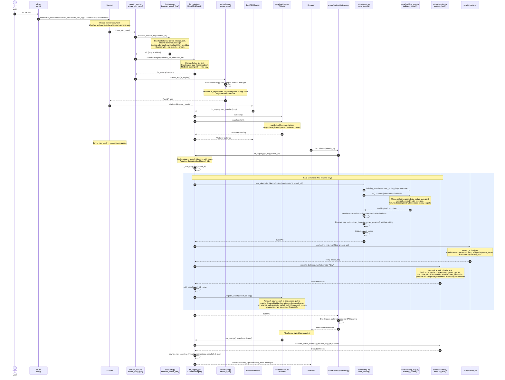

# Dev Server Startup — Sequence Diagram, Responsibility Verdicts, and Follow-up Prompts

## Sequence Diagram

---

## Responsibility Verdicts

| Location | Class / Function | Verdict | Rationale |
|---|---|---|---|
| `cli.py` | `dev()` | **clean** | Single job: configure and hand off to uvicorn. No domain logic. |
| `server/_dev.py` | `create_dev_app()` | **clean** | Minimal glue — discover, construct registry, build app. Three lines. |
| `discovery.py` | `discover_sketch_fns()` | **clean** | One job: scan for `__is_sketch__` callables and return a slug dict. Side-effect of mutating `sys.path` is unfortunate but scoped. |
| `server/app.py` | `create_app()` | **clean** | Factory + lifespan wiring only. Correctly delegates watcher lifecycle to the registry. |
| `server/app.py` | `lifespan` (inner async generator) | **clean** | Thin bridge between FastAPI startup/shutdown and `SketchFnRegistry.start_watcher / stop_watcher`. |
| `server/fn_registry.py` | `SketchFnRegistry` | **overloaded** | Holds five distinct concerns: (1) sketch-fn catalog, (2) BuiltDAG cache + lazy loading, (3) preset dirty/based_on state, (4) file watcher lifecycle + path registration, (5) WebSocket connection set and broadcast. Each concern is coherent on its own but all five live in one 200-line class. |
| `fn_registry.py` | `get_dag()` | **clean** | Double-checked lock is correct — outer check avoids lock contention on hot path; inner re-check prevents double-wiring under race. Pattern is intentional and sound given the threading model. |
| `fn_registry.py` | `_load_dag_lazy()` | **overloaded** | Does wire, preset load, full execute, watcher registration, and timing in a single method. Each step could be a named collaborator. |
| `fn_registry.py` | `set_param()` | **clean** | Coerce-store-persist-execute is a tight, atomic sequence for a param update. Reasonable size. |
| `fn_registry.py` | `start_watcher()` | **clean** | Creates and starts the Watcher, iterates already-loaded DAGs. Correct but note: at startup no DAGs exist yet, so the loop is always empty on first boot — watcher registration happens per-sketch in `_load_dag_lazy` instead. |
| `fn_registry.py` | `_register_watch()` | **unclear** | The closure captures `dag` and `workdir` by default-arg binding, which avoids the late-binding bug, but the technique is non-obvious and undocumented. The `# type: ignore` on `self._loop` also signals fragility. |
| `fn_registry.py` | `broadcast()` / `broadcast_results()` | **misplaced** | WebSocket fan-out is a separate concern from DAG lifecycle. A dedicated `ConnectionManager` class would make both easier to test and reason about. |
| `core/building_dag.py` | `BuildingDAG` | **clean** | Pure data recorder. No execution. `allocate_id` is a correct uniqueness strategy. |
| `core/building_dag.py` | `building_sketch()` | **clean** | ContextVar pattern correctly isolates nested invocations. |
| `core/building_dag.py` | `source()` / `output()` | **clean** | Thin free functions that delegate to the active DAG. Fail loudly outside context. |
| `core/decorators.py` | `@sketch` decorator | **clean** | Only stamps `__is_sketch__` and `__sketch_meta__`. No wiring logic. Correctly separated from `wire_sketch`. |
| `core/decorators.py` | `@step` decorator | **clean** | Dual-mode design (immediate vs. record) is a necessary pattern; the `_active_dag.get()` branch is the only complexity and it's essential. `__wrapped__` preservation for introspection is correct. |
| `core/wiring.py` | `wire_sketch()` | **clean** | Linear three-phase resolution (sources → steps → outputs). Validation is inline but each error message is specific. |
| `core/wiring.py` | `_make_source_fn()` | **clean** | One-liner factory; closure over `loader` and `resolved_path` is correct. |
| `core/built_dag.py` | `BuiltDAG` | **clean** | Pure resolved data structure. `topo_sort()` returns insertion order (valid since wiring respects topo order). |
| `core/built_dag.py` | `BuiltNode` | **clean** | Plain dataclass; mutable `output` and `param_values` are intentional for in-place update semantics. |
| `core/built_dag.py` | `descendants()` | **unclear** | BFS is correct but iterates all nodes for every queue entry — O(N²) for wide DAGs. Acceptable at current scale but not flagged anywhere. |
| `core/executor.py` | `execute_built()` / `execute_partial_built()` | **clean** | Clear entry points; subset computation for partial re-execution is correct. |
| `core/executor.py` | `_execute_nodes()` | **clean** | Upstream failure propagation is explicit and tested. `dev`-only disk writes are guarded by a mode check. |
| `core/executor.py` | `_find_ctx_param()` | **clean** | Isolated helper; graceful fallback on annotation resolution failure. |
| `core/watcher.py` | `Watcher` | **clean** | Thin wrapper over watchdog `Observer`. Handles all four file-event types including Finder's create-on-replace behavior. |
| `core/watcher.py` | `_SourceFileHandler` | **clean** | Per-file handler with path identity check. Correctly resolves symlinks via `.resolve()`. |
| `core/presets.py` | `load_active_into_built()` | **clean** | Reads, applies, and returns dirty/based_on with no side effects on disk. |
| `core/presets.py` | `save_active_from_built()` | **clean** | Single responsibility: serialize current param state to `_active.json`. |
| `core/introspect.py` | `extract_inputs()` | **clean** | Correctly skips `SketchContext`, unwraps `@step` wrapper, handles `T | None` optionality. |
| `core/introspect.py` | `extract_params()` | **clean** | Correctly requires `Annotated[T, Param(...)]` pattern and explicit defaults. |
| `server/routes/sketches.py` | Route handlers | **overloaded** | Several routes directly mutate `fn_registry._dirty` and `fn_registry._based_on` (private attributes), breaking encapsulation. That state management belongs in `SketchFnRegistry` methods, not in route handlers. |

---

## Follow-up Prompts

### FP-1: Split SketchFnRegistry into focused collaborators

**Paste this into a new session:**

> `SketchFnRegistry` in `framework/src/sketchbook/server/fn_registry.py` currently owns five distinct concerns: (1) the slug→callable catalog, (2) the BuiltDAG cache and lazy wiring/execution, (3) preset dirty/based\_on state, (4) the file-watcher lifecycle and per-path registration, and (5) the WebSocket connection set and broadcast fan-out. Propose a decomposition into focused collaborators — candidate split: `DagCache` (concerns 2+3), `WatcherCoordinator` (concern 4), and `ConnectionManager` (concern 5) — with `SketchFnRegistry` becoming a thin facade. For each proposed class, write the interface, move the existing logic, update `create_app` and the route handlers, and ensure the unit tests cover each class independently. Keep the public API surface of `SketchFnRegistry` stable so route handlers need minimal changes.

---

### FP-2: Audit route handlers mutating private registry state

**Paste this into a new session:**

> In `framework/src/sketchbook/server/routes/sketches.py`, the `save_preset`, `new_preset`, and `load_preset` route handlers directly write to `fn_registry._dirty` and `fn_registry._based_on` — private attributes of `SketchFnRegistry`. This breaks the encapsulation boundary. Audit all direct accesses to private `_` attributes of `fn_registry` from route handlers, replace each with a dedicated method on `SketchFnRegistry` (e.g., `mark_clean(sketch_id, based_on)`, `reset_to_defaults(sketch_id)`), and add unit tests for each new method. Ensure the route handlers only call public methods.

---

### FP-3: Document and test the double-checked locking in get_dag

**Paste this into a new session:**

> `SketchFnRegistry.get_dag()` in `framework/src/sketchbook/server/fn_registry.py` uses a double-checked locking pattern: a fast unlocked cache read, followed by lock acquisition, followed by a second cache read inside the lock. The pattern is correct in Python under the GIL for dict reads, but it is undocumented and has no concurrent unit test. Add: (1) an inline comment explaining why the pattern is safe and what the inner re-check prevents, (2) a unit test that fires two threads simultaneously against the same sketch slug and asserts `_load_dag_lazy` is called exactly once, and (3) a note on whether the pattern remains safe if the GIL is removed (free-threaded CPython / PEP 703).

---

### FP-4: Clarify the default-arg closure binding in _register_watch

**Paste this into a new session:**

> In `SketchFnRegistry._register_watch()` (`framework/src/sketchbook/server/fn_registry.py`, the `on_change` closure captures `sketch_id`, `dag`, `source_step_id`, and `workdir` via default-argument binding (`sid: str = sketch_id`, etc.) rather than a direct closure over the loop variable. This avoids the classic Python late-binding bug but the technique is non-obvious and undocumented. Additionally, `self._loop` is passed with a `# type: ignore` comment. Refactor `_register_watch` to: (1) replace the default-arg trick with `functools.partial` or an explicit factory function that is clearly named, (2) resolve the `self._loop` type-ignore by asserting or restructuring the call site, and (3) add a unit test verifying that registering multiple source paths on the same DAG creates independent callbacks that each only re-execute from their own source node.

---

### FP-5: Investigate start_watcher loop-before-load ordering issue

**Paste this into a new session:**

> In `SketchFnRegistry.start_watcher()` (`framework/src/sketchbook/server/fn_registry.py`), the watcher is started and then populates watch paths by iterating `self._dags` — but at the time `start_watcher` is called during FastAPI lifespan startup, `self._dags` is always empty (all DAGs are lazy-loaded on first request). The actual path registration happens inside `_load_dag_lazy` via a conditional `_register_watch` call. This means the `for sketch_id, dag in self._dags.items()` loop in `start_watcher` is dead code in the normal startup path. Investigate: (1) Is there any code path where `_dags` is non-empty at `start_watcher` time? (2) Should path registration happen eagerly (during startup, before first request)? (3) If not, should the dead loop be removed and the contract of `start_watcher` clarified? Add a test that confirms watcher callbacks fire correctly when paths are registered after `start_watcher` has already been called.

---

### FP-6: Assess O(N²) descendants() in BuiltDAG for large pipelines

**Paste this into a new session:**

> `BuiltDAG.descendants()` in `framework/src/sketchbook/core/built_dag.py` performs a BFS but re-scans all nodes for each item popped from the queue. For a DAG with N nodes, worst-case cost is O(N²). Currently pipelines are short linear chains, so this is harmless, but partial re-execution (`execute_partial_built`) calls `descendants()` for every source-file change. Propose a fix: precompute a reverse-adjacency index (`dependents: dict[str, list[str]]`) when `BuiltDAG` is finalized after wiring, and rewrite `descendants` as a standard BFS over that index (O(N + E)). Ensure existing tests still pass and add a test with a branching DAG.
