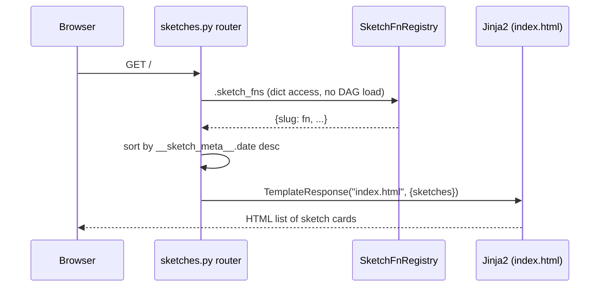
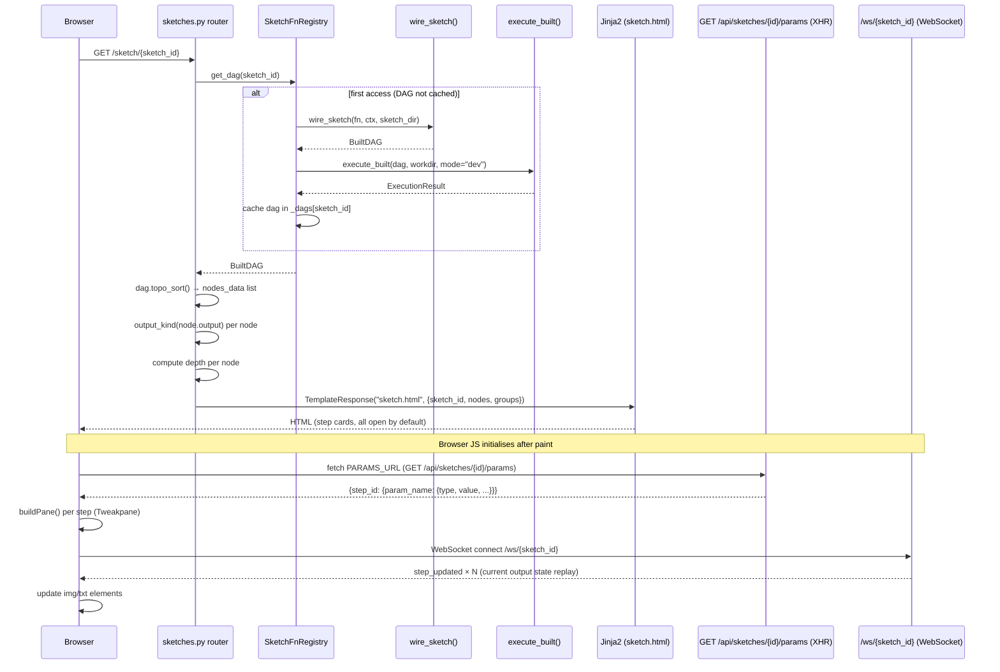
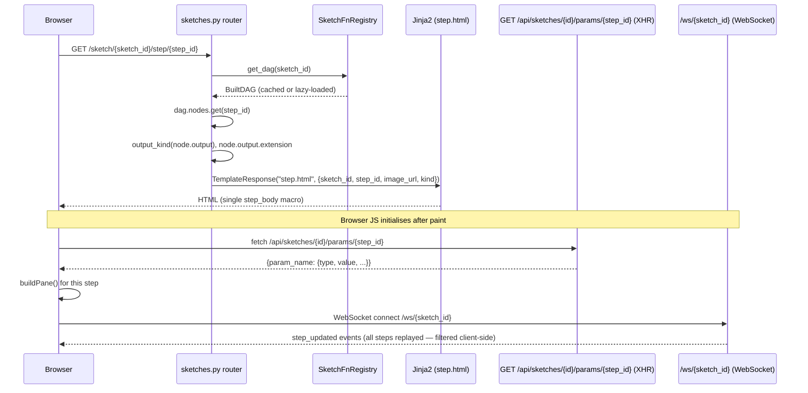
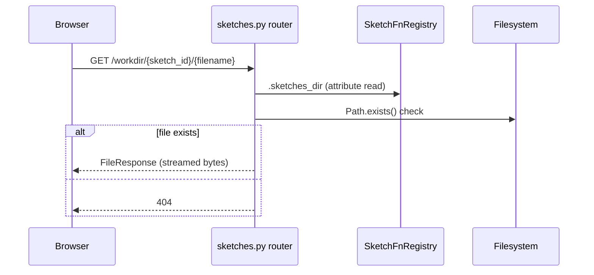
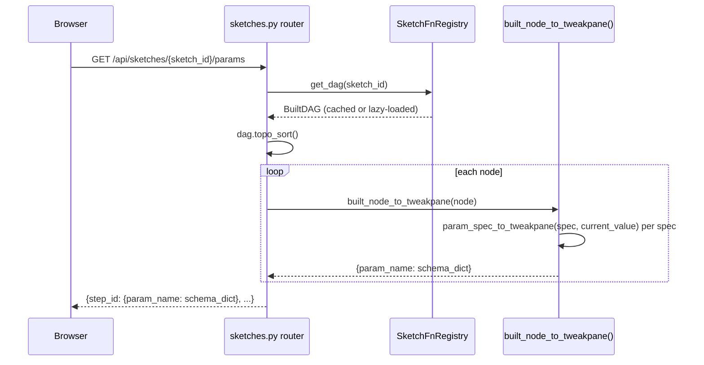
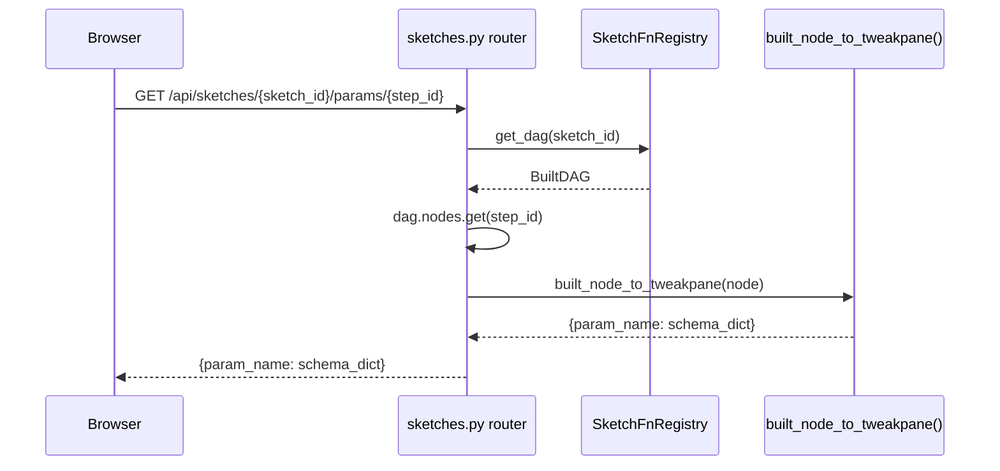

# Page Routes — Sequence Diagrams & Code Audit

## Sequence Diagrams

### GET / — Sketch Index

### GET /sketch/{sketch_id} — Sketch View

### GET /sketch/{sketch_id}/step/{step_id} — Step View

### GET /workdir/{sketch_id}/{filename} — Workdir File Serving

### GET /api/sketches/{sketch_id}/params — Full Tweakpane Schema

### GET /api/sketches/{sketch_id}/params/{step_id} — Single Step Schema

---

## Responsibility Verdicts

| Class / Function | Verdict | Rationale |
|---|---|---|
| `sketch_index` (route handler) | **clean** | Single concern: read `sketch_fns`, sort, render template. No business logic leaks in. |
| `sketch_view` (route handler) | **overloaded** | Computes DAG depth in-line (a graph algorithm), builds `nodes_data`, and renders — three distinct concerns in one function. The depth computation belongs in `BuiltDAG` or a helper. |
| `sketch_step_view` (route handler) | **clean** | Minimal: validate existence, derive URL, render template. |
| `sketch_workdir_file` (route handler) | **clean** | Pure path construction + `FileResponse`. No hidden logic. |
| `get_all_params` (route handler) | **clean** | One liner: `topo_sort()` → `built_node_to_tweakpane()` per node. |
| `get_step_params` (route handler) | **clean** | Validate presence, delegate to `built_node_to_tweakpane`. |
| `SketchFnRegistry` | **overloaded** | Owns DAG cache, lazy wiring, preset dirty-tracking, file watcher lifecycle, and WebSocket connection management. Five responsibilities in one object — it is the God object of the server layer. |
| `SketchFnRegistry.get_dag` | **clean** | Double-checked locking for thread safety is correct and intentional. |
| `SketchFnRegistry._load_dag_lazy` | **overloaded** | Wires, loads preset, executes, registers watcher — four sequential side-effects. Each is a candidate for a dedicated method. |
| `SketchFnRegistry.set_param` | **clean** | Coerce-then-store-then-execute is the right sequence; caller is responsible for coercion as documented. |
| `SketchFnRegistry.broadcast_results` | **clean** | Straightforward loop over execution result nodes; correctly defers to `broadcast`. |
| `BuiltDAG` | **clean** | Plain data container + two algorithms (`topo_sort`, `descendants`). No server or I/O concerns. |
| `BuiltDAG.topo_sort` | **unclear** | Named "topo sort" but simply returns insertion order, relying on the invariant that `wire_sketch` inserts nodes in topological order. This is correct but the name implies a real sort. A clarifying docstring note would help; the method is not wrong but the name is misleading. |
| `BuiltDAG.descendants` | **clean** | BFS on adjacency implied by `source_ids`, no hidden dependencies. |
| `BuiltNode` | **clean** | Pure data class. `output` being mutable is a deliberate executor contract. |
| `ParamSpec` | **clean** | Value object with no behaviour. |
| `output_kind` | **clean** | Single dispatch on protocol membership; falls back safely. |
| `SketchValueProtocol` | **clean** | Minimal runtime-checkable structural protocol. |
| `built_node_to_tweakpane` | **clean** | Pure transform from `BuiltNode` to a JSON-serialisable dict. |
| `param_spec_to_tweakpane` | **clean** | Pure transform from `ParamSpec` + current value to a schema dict. Handles the optional `to_tweakpane()` escape hatch cleanly. |
| `wire_sketch` | **clean** | Single responsibility: run the sketch function inside `building_sketch()`, resolve proxies, build a `BuiltDAG`. |
| `_make_source_fn` | **clean** | Simple closure factory. |
| `execute_built` | **clean** | Thin wrapper over `_execute_nodes` with `subset=None`. |
| `execute_partial_built` | **clean** | Computes subset via `descendants()`, delegates to `_execute_nodes`. |
| `_execute_nodes` | **clean** | Single loop with clear failure propagation; dev/build mode distinction is minimal and correct. |
| `_find_ctx_param` | **misplaced** | Type-hint introspection utility that lives in `executor.py` but is reusable general infrastructure. Should live in `core/introspect.py` alongside `extract_inputs` and `extract_params`. |
| `base.html` | **overloaded** | Includes all preset JS, Tweakpane CDN import, `buildPane()`, and `fetchAndRenderPresets()` in a single `<script type="module">` block even though `index.html` overrides `toolbar_controls` to remove the preset bar. Dead JS runs on every page including the index. |
| `sketch.html` | **clean** | Correctly extends `base.html`, delegates step rendering to the `step_body` macro, and keeps WebSocket + Tweakpane wiring in the `scripts` block. |
| `step.html` | **unclear** | Fetches `/api/…/params/{step_id}` and handles `data.params ?? data` — the `?? data` fallback suggests an inconsistency between the API response shape and what the template expects. The API returns a flat dict, not `{params: ...}`, making the `data.params` branch dead code. |
| `macros.html` | **clean** | Exactly two macros, both small and cohesive. |
| `index.html` | **clean** | Pure listing, no scripts, overrides `toolbar_controls` to suppress presets. |
| `_list_preset_names` | **clean** | Simple glob + filter; not a method because it only needs a `Path`. |

---

## Follow-up Prompts

**FP-1 — Refactor `sketch_view` depth computation out of the route handler**

> In `framework/src/sketchbook/server/routes/sketches.py`, `sketch_view` contains an inline DAG-depth computation (longest path from roots). This is a graph algorithm that belongs either on `BuiltDAG` or in a server-layer helper. Move it, add a unit test, and verify `sketch_view` only calls it without duplicating the logic. Confirm no other route handler computes depth independently.

**FP-2 — Split `SketchFnRegistry` into focused collaborators**

> `SketchFnRegistry` in `framework/src/sketchbook/server/fn_registry.py` owns five distinct responsibilities: DAG caching, lazy wiring/execution, preset dirty-tracking state (`_dirty`, `_based_on`), file watcher lifecycle, and WebSocket connection management. Propose a decomposition — e.g. a `DAGCache`, a `PresetState`, and a `ConnectionHub` — and sketch the new ownership boundaries, ensuring the thread-safety invariant around `_locks` is preserved in whichever object owns the cache.

**FP-3 — Rename or document `BuiltDAG.topo_sort`**

> `BuiltDAG.topo_sort()` in `framework/src/sketchbook/core/built_dag.py` returns `list(self.nodes.values())`, relying entirely on the invariant that `wire_sketch` inserts nodes in topological order. The name implies an active sort. Either rename the method to `ordered_nodes()` (and update all callsites) or add an explicit docstring invariant note and a test that verifies order is actually topological. Audit all callsites to confirm none assume a re-sort happens.

**FP-4 — Move `_find_ctx_param` to `core/introspect.py`**

> `_find_ctx_param` in `framework/src/sketchbook/core/executor.py` is a type-hint introspection utility identical in nature to `extract_inputs` and `extract_params` in `core/introspect.py`. Move it, update the import in `executor.py`, add or extend the introspect unit tests to cover it, and verify no circular imports are introduced.

**FP-5 — Remove dead `data.params ?? data` branch in `step.html`**

> In `framework/src/sketchbook/server/templates/step.html`, the JS fetches `/api/sketches/{id}/params/{step_id}` and accesses `data.params ?? data`. The API (`get_step_params`) returns a flat dict, never `{params: ...}`, so `data.params` is always `undefined`. Confirm the API shape, remove the fallback branch, and add a comment or test that documents the expected response shape so this confusion cannot re-emerge.

**FP-6 — Audit base.html preset JS running on the index page**

> `base.html` unconditionally imports Tweakpane and runs `fetchAndRenderPresets()` and `init()` in a `<script type="module">` block. `index.html` overrides `toolbar_controls` to hide the preset bar, but the JS still executes (with `SKETCH_ID = ""`). Evaluate whether `base.html` should guard the preset/Tweakpane JS behind a `` that `index.html` overrides to a no-op, or whether `index.html` should not extend `base.html` at all.

**FP-7 — Investigate WebSocket replay on step.html filtering all-step events client-side**

> When the browser connects to `/ws/{sketch_id}` from `step.html`, the server in `sketch_ws_endpoint` replays `step_updated` for every node in the DAG. The client then filters to only `msg.step_id === STEP_ID`. For large pipelines this sends unnecessary data over the wire. Investigate whether the WebSocket endpoint should accept an optional `step_id` query parameter to replay only the relevant node, and whether this optimisation is worth the added complexity.
