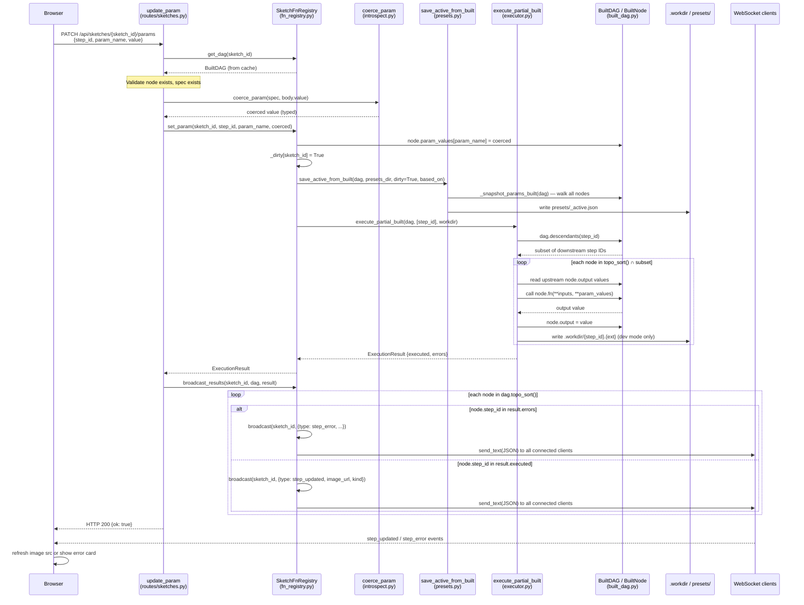

# Param Update Flow: PATCH /api/sketches/{sketch_id}/params

## Sequence Diagram

---

## Responsibility Verdicts

| Class / Function | Verdict | Rationale |
|---|---|---|
| `update_param` (routes/sketches.py:218) | **clean** | Thin handler: validate → coerce → delegate → broadcast → return. No logic leaks in. |
| `ParamUpdate` (routes/sketches.py:210) | **clean** | Minimal Pydantic model at the wire boundary; exactly the right place for it. |
| `coerce_param` (introspect.py:165) | **clean** | Single purpose: coerce raw wire value to the declared param type. |
| `_coerce_bool` (introspect.py:145) | **clean** | Explicit string→bool mapping with loud, actionable errors. |
| `SketchFnRegistry.set_param` (fn_registry.py:96) | **overloaded** | Does three distinct things in sequence: mutate in-memory state, persist to disk, re-execute. If execution fails the param is already saved — ordering is fragile. |
| `SketchFnRegistry.get_dag` (fn_registry.py:54) | **clean** | Lazy load with double-checked locking. Correctly separates the fast path (cache hit) from the slow path (wire + execute). |
| `SketchFnRegistry.broadcast_results` (fn_registry.py:176) | **clean** | Translates `ExecutionResult` into typed WebSocket events; iterates all topo nodes so downstream errors surface. |
| `SketchFnRegistry.broadcast` (fn_registry.py:166) | **clean** | Fire-and-forget JSON push; dead connection pruning is the right place for it. |
| `execute_partial_built` (executor.py:51) | **clean** | Thin wrapper: compute subset → delegate to `_execute_nodes`. Separation is appropriate. |
| `_execute_nodes` (executor.py:68) | **slightly overloaded** | Combines compute (call `node.fn`), in-memory mutation (`node.output`), and conditional disk I/O in a single loop. The `mode` branch makes I/O optional but keeps it coupled to execution. |
| `BuiltDAG.topo_sort` (built_dag.py:53) | **unclear** | Does not sort — it returns `list(self.nodes.values())` and relies on nodes being inserted in topo order during wiring. The invariant is real but invisible here; the name overpromises. |
| `BuiltDAG.descendants` (built_dag.py:57) | **clean** | Straightforward BFS; single responsibility. |
| `BuiltNode` (built_dag.py:24) | **clean** | Pure data holder; fields are minimal and coherent. |
| `ParamSpec` (built_dag.py:13) | **clean** | Schema entry: name, type, default, UI metadata. No behavior leaks in. |
| `save_active_from_built` (presets.py:74) | **clean** | Snapshot all param values → write `_active.json`. Single responsibility. |
| `_snapshot_params_built` (presets.py:37) | **clean** | Read-only DAG walk to produce a serializable dict. |
| `output_kind` (protocol.py:25) | **clean** | One-liner duck-type check; correct place for it. |
| `SketchValueProtocol` (protocol.py:8) | **clean** | Minimal structural protocol; `runtime_checkable` is correctly used for `isinstance` checks in the executor and broadcast. |
| `built_node_to_tweakpane` (tweakpane.py:37) | **clean** | Maps `BuiltNode` → Tweakpane schema dict; no side effects. |
| `param_spec_to_tweakpane` (tweakpane.py:10) | **clean** | Maps `ParamSpec` + current value → Tweakpane wire object. The `to_tweakpane()` duck-type escape hatch for rich types is a good pattern. |

---

## Follow-up Prompts

Paste any of these into a new session for deeper investigation.

---

### FU-1: `BuiltDAG.topo_sort` — hidden invariant, misleading name

> **Context:** `BuiltDAG.topo_sort` (built_dag.py:53) does no sorting. It returns `list(self.nodes.values())` and relies on `dict` insertion order equalling topological order — an invariant enforced entirely in `wire_sketch`, invisible at the call site.
>
> **Investigate:** Read `framework/src/sketchbook/core/wiring.py` end-to-end. Verify the invariant is maintained for every code path that inserts into `BuiltDAG.nodes`. Then decide: (a) rename to `nodes_in_order()` or similar, or (b) add a runtime assertion or comment that documents the invariant so the next reader doesn't have to trace it back to wiring. Do not change behaviour — only clarify.

---

### FU-2: `set_param` — disk write before execution; failure leaves stale `_active.json`

> **Context:** `SketchFnRegistry.set_param` (fn_registry.py:96–114) calls `save_active_from_built` before calling `execute_partial_built`. If execution raises or produces errors, `_active.json` already reflects the new param value but the workdir output is stale or deleted. On the next load, the persisted value will be applied but may produce a broken output.
>
> **Investigate:** Determine whether this is an acceptable trade-off (simplicity, no rollback needed) or a real bug (param persisted but output never produced). If it should be fixed: move `save_active_from_built` after `execute_partial_built` and only persist if `result.ok`. Write a unit test that asserts `_active.json` is *not* written when execution fails.

---

### FU-3: Thread-safety race on `BuiltNode` mutations

> **Context:** Two code paths mutate `node.param_values` and `node.output` on the same `BuiltNode` objects:
> 1. HTTP route → `set_param` → `execute_partial_built` (runs on the async event loop thread).
> 2. File watcher → `on_change` callback → `execute_partial_built` via `asyncio.run_coroutine_threadsafe` (called from the watchdog thread).
>
> There is no lock around `BuiltNode` mutations in either path. `_locks` in `SketchFnRegistry` only guards `_load_dag_lazy` (initial wiring).
>
> **Investigate:** Add a per-sketch `asyncio.Lock` (not a threading lock) to `SketchFnRegistry` and acquire it around both `set_param` and the `broadcast_results` coroutine in `_register_watch`. Write a test that demonstrates a race (or confirm one cannot occur because the event loop is single-threaded and `run_coroutine_threadsafe` schedules onto it, making concurrent execution impossible by design).

---

### FU-4: `broadcast_results` iterates the full DAG — partial execution sends no-op events

> **Context:** `broadcast_results` (fn_registry.py:176) calls `dag.topo_sort()` and checks each node against `result.executed` and `result.errors`. For a param change on step N, only N and its descendants are in the result. All ancestor nodes produce neither a `step_updated` nor a `step_error` event — they are silently skipped.
>
> This is correct but potentially surprising: if a client reconnects mid-execution, it will receive a WebSocket initial dump of all outputs (in `sketch_ws_endpoint`), then only partial updates going forward. Verify that this never causes the browser to display a stale ancestor image after a partial re-execution. If ancestors are image steps whose on-disk file hasn't changed, there is no bug — but confirm it in the browser.

---

### FU-5: `coerce_param` silent pass-through for unknown rich types

> **Context:** `coerce_param` (introspect.py:165–178) handles `bool`, `int`, `float`, `str` explicitly. For any other type it tries `spec.type(raw)` and, if `raw` is already an instance, returns it unchanged. Rich param types (e.g., a hypothetical `Color` or `Gradient`) received over the wire as a `dict` or `str` from Tweakpane will hit the `spec.type(raw)` branch — which may raise or silently produce a wrong value if the type's constructor doesn't accept the wire form.
>
> **Investigate:** Survey every `Param()`-annotated parameter across all sketches under `sketches/` to find non-primitive types. For each, trace what Tweakpane sends on the wire and what `coerce_param` would produce. Decide whether to add an explicit protocol (`TweakpaneCoercible`) or a `to_tweakpane` / `from_tweakpane` round-trip test.
