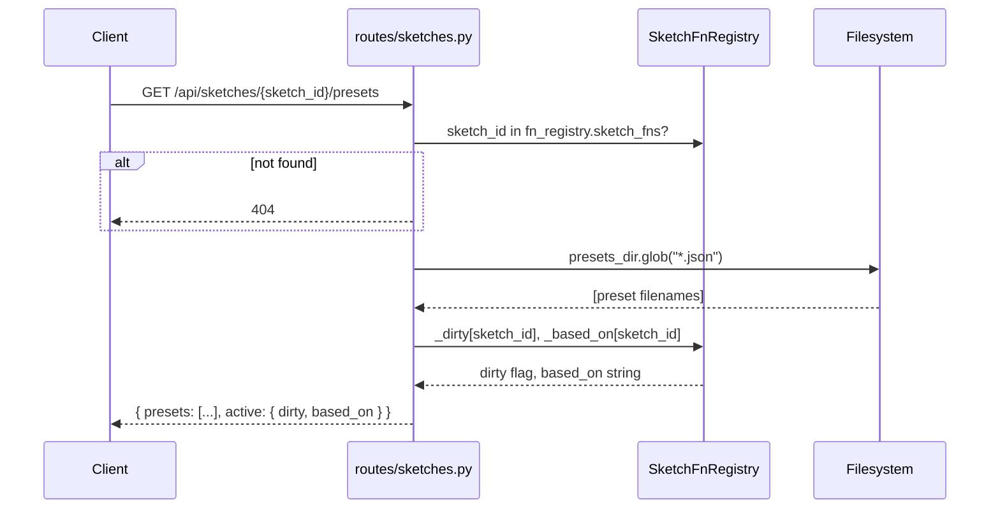
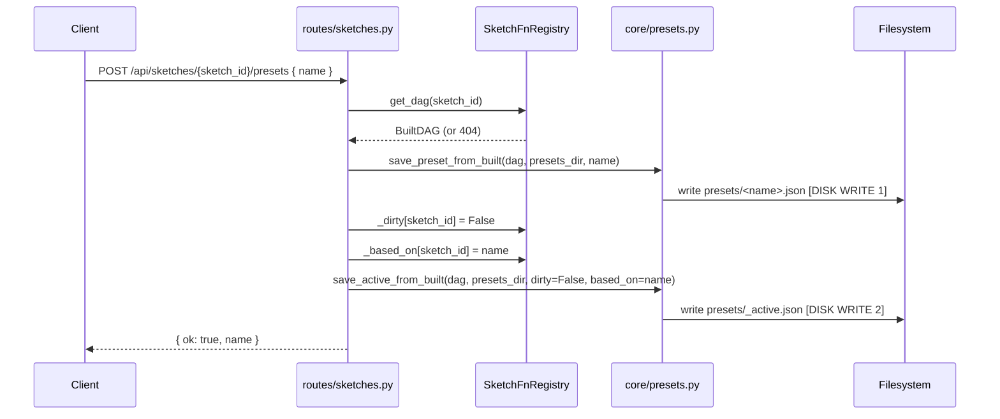
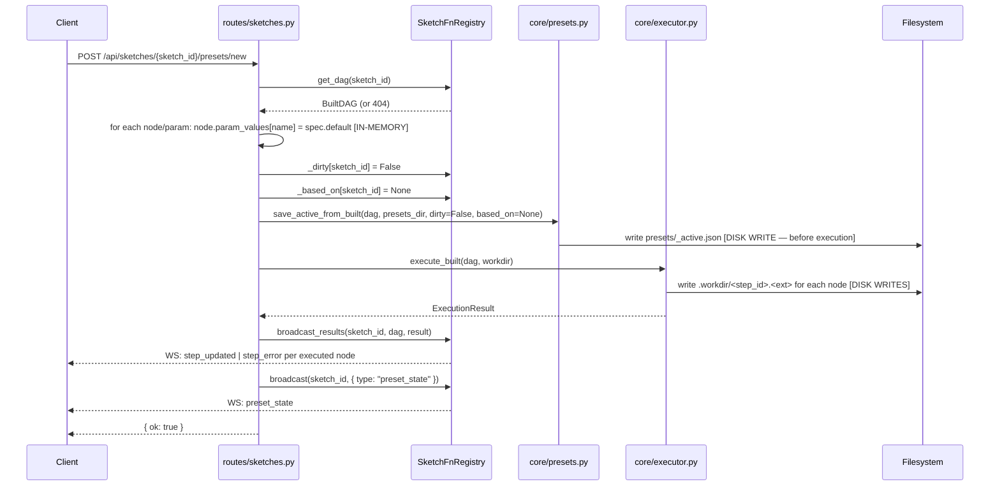
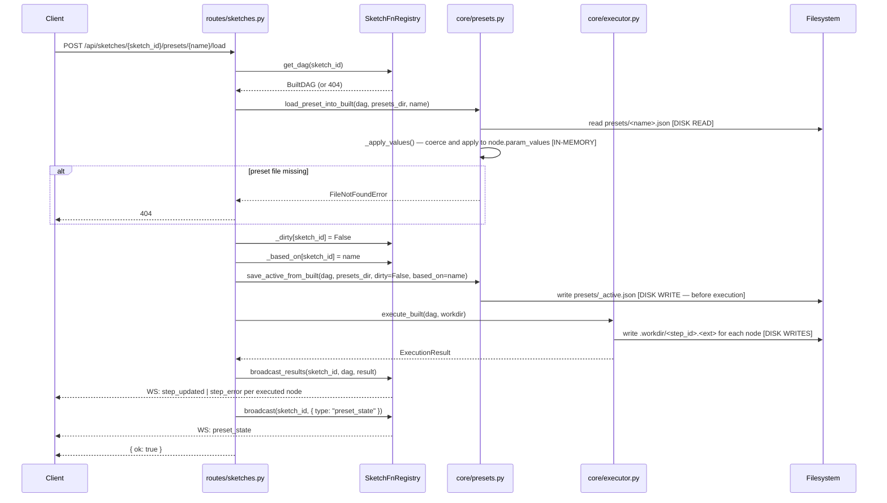

# Preset API — End-to-End Diagrams and Audit

## Sequence Diagrams

### GET /api/sketches/{sketch_id}/presets

Note: The route checks `fn_registry.sketch_fns` (registered functions) rather than
`fn_registry._dags` (loaded DAGs). A sketch can appear in the list even if it has never
been loaded — its presets directory is scanned unconditionally from disk.

---

### POST /api/sketches/{sketch_id}/presets (save named preset)

No re-execution. No broadcast. The route only persists the current in-memory param
values; execution state and workdir outputs are left as-is.

---

### POST /api/sketches/{sketch_id}/presets/new (reset to defaults)

---

### POST /api/sketches/{sketch_id}/presets/{name}/load

---

## Responsibility Verdicts

| Component | Class / Function | Verdict | Rationale |
|-----------|-----------------|---------|-----------|
| `routes/sketches.py` | `list_presets` | **clean** | Delegates cleanly; combines disk scan with registry dirty/based_on state. One responsibility: produce the list payload. |
| `routes/sketches.py` | `save_preset` | **overloaded** | Mutates `_dirty` and `_based_on` directly on the registry — that state management belongs in the registry, not the route handler. |
| `routes/sketches.py` | `new_preset` | **overloaded** | Directly iterates `dag.topo_sort()` and writes `node.param_values` — the route handler owns DAG mutation logic that should live in a dedicated function or registry method. Also mutates `_dirty`/`_based_on` directly. |
| `routes/sketches.py` | `load_preset` | **clean** | Delegates DAG mutation to `load_preset_into_built`, state to the registry, persistence to `save_active_from_built`, execution to `execute_built`. The ordering is consistent with `new_preset`. |
| `routes/sketches.py` | `_list_preset_names` | **misplaced** | Duplicates `core/presets.py::list_preset_names` exactly. An identical function already exists in the core. The route module defines its own private copy instead of importing it. |
| `core/presets.py` | `load_active_into_built` | **clean** | One job: read `_active.json`, apply values, return `(dirty, based_on)`. No side effects beyond mutating `param_values`. |
| `core/presets.py` | `save_active_from_built` | **clean** | One job: snapshot `param_values` and write `_active.json` with `_meta`. |
| `core/presets.py` | `load_preset_into_built` | **clean** | One job: read named preset, apply values. Explicit contract: does not write `_active.json` (caller handles that). |
| `core/presets.py` | `save_preset_from_built` | **clean** | One job: snapshot `param_values` to `<name>.json`. No meta, no side effects. |
| `core/presets.py` | `list_preset_names` | **clean** | Simple, side-effect-free, correctly excludes `_active`. |
| `core/presets.py` | `_snapshot_params_built` | **clean** | Pure function; produces a flat dict of current values from the DAG. |
| `core/presets.py` | `_apply_values` | **clean** | Coerces and applies a values dict to a single node; unknown keys are silently skipped (intentional defensive behaviour, but see follow-up #3). |
| `core/presets.py` | `_Encoder` | **clean** | Minimal custom encoder; correctly delegates to `to_tweakpane()` for protocol-typed param values. |
| `server/fn_registry.py` | `SketchFnRegistry` | **overloaded** | Owns DAG cache, file watchers, WebSocket connections, and dirty/based_on state — four concerns. The dirty/based_on tracking is a preset-layer concern that could be extracted. |
| `server/fn_registry.py` | `get_dag` | **clean** | Double-checked locking for lazy load is correct and intentional. |
| `server/fn_registry.py` | `_load_dag_lazy` | **clean** | Wires, loads active preset, executes — logical startup sequence, ordered correctly. |
| `server/fn_registry.py` | `set_param` | **overloaded** | Persists `_active.json` then re-executes — same ordering as `new_preset`/`load_preset` (disk write before workdir), which is consistent. However the method is doing three things: state mutation, persistence, and execution. |
| `server/fn_registry.py` | `broadcast_results` | **clean** | Single responsibility: iterate `ExecutionResult` and push WebSocket messages. |
| `server/fn_registry.py` | `broadcast` | **clean** | Thin wrapper; removes dead connections on send failure. |
| `core/executor.py` | `ExecutionResult` | **clean** | Simple value object; `ok` property is a convenience. |
| `core/executor.py` | `execute_built` | **clean** | Thin entry point; delegates to `_execute_nodes`. |
| `core/executor.py` | `execute_partial_built` | **clean** | Correctly computes the dirty subgraph (start nodes + descendants) before delegating. |
| `core/executor.py` | `_execute_nodes` | **clean** | Core executor loop; upstream-failure propagation, output caching on `node.output`, and conditional workdir writes are all correct. |
| `core/built_dag.py` | `BuiltDAG` | **clean** | Pure data container; no business logic beyond topo-sort (insertion-order dict) and BFS descendants. |
| `core/built_dag.py` | `BuiltNode` | **clean** | Plain data container. `output` being mutable on the node is intentional (executor caches intermediate results for partial re-execution). |
| `core/built_dag.py` | `BuiltDAG.descendants` | **unclear** | BFS is correct but uses `list.pop(0)` (O(n) per pop) on what could be a `collections.deque`. Not a correctness issue but signals the function was written without thought for deeper DAGs. |

---

## Follow-up Prompts

### Follow-up 1 — Duplicate `_list_preset_names` in the route layer

`routes/sketches.py` defines a private `_list_preset_names` function (line 255–259) that
is byte-for-byte identical to `core/presets.list_preset_names` (lines 115–124). The route
module already imports three functions from `core/presets`; it should import the fourth
rather than defining its own copy.

**Prompt to paste:**

> In `framework/src/sketchbook/server/routes/sketches.py`, the private `_list_preset_names` function is a duplicate of `core/presets.list_preset_names`. Remove the private copy, add `list_preset_names` to the import from `sketchbook.core.presets`, and update the `list_presets` route to call the imported version. Verify all tests still pass.

---

### Follow-up 2 — Dirty/based_on mutation belongs in the registry, not the route

`save_preset`, `new_preset`, and `load_preset` all write directly to
`fn_registry._dirty[sketch_id]` and `fn_registry._based_on[sketch_id]`. These are
internal dict fields (conventionally private by the leading underscore). The registry
already has a `set_param` method that owns that same mutation. The route handlers should
not reach into the registry's private state.

**Prompt to paste:**

> `SketchFnRegistry` has private `_dirty` and `_based_on` dicts that are mutated directly by route handlers in `routes/sketches.py`. Encapsulate this behind registry methods: add `set_preset_state(sketch_id, dirty, based_on)` (or equivalent) to `SketchFnRegistry`, and update the three mutating preset routes (`save_preset`, `new_preset`, `load_preset`) to call that method instead of reaching into `_dirty`/`_based_on` directly. Write unit tests for the new method.

---

### Follow-up 3 — `new_preset` route mutates DAG nodes directly

`new_preset` contains an inline loop that resets `node.param_values` to defaults
(lines 301–303). This is the only place in the codebase that performs a "reset to
defaults" operation, yet it lives in a route handler rather than in `core/presets.py`
alongside the other DAG-mutation operations. If this pattern is ever needed elsewhere
(e.g., in the file watcher on sketch reload) it will be copy-pasted.

**Prompt to paste:**

> The `new_preset` route handler in `routes/sketches.py` directly iterates `dag.topo_sort()` and resets `node.param_values[name] = spec.default`. Extract this logic into a new function `reset_to_defaults(dag: BuiltDAG) -> None` in `framework/src/sketchbook/core/presets.py`. Add a unit test. Update `new_preset` to call the new function. Confirm the inline loop is removed from the route.

---

### Follow-up 4 — `_active.json` is written before execution succeeds (non-atomic)

Both `new_preset` and `load_preset` follow this sequence:

1. Mutate in-memory `param_values`
2. Write `_active.json` to disk
3. Call `execute_built` (may raise or produce errors)

If execution fails or the process is killed between steps 2 and 3, `_active.json` reflects
param values that were never successfully rendered. On the next server startup
`_load_dag_lazy` will reload those params (correct) but the workdir will be stale (from
the previous run). This is probably acceptable — workdir is ephemeral and gets regenerated
— but the dirty flag will be `False` even though the workdir does not match the stored
state. `save_preset` has the opposite atomicity concern: it writes `<name>.json` before
writing `_active.json`. A crash between those two writes leaves a named preset that exists
on disk but whose `_active.json` still has `dirty=True` and the old `based_on`.

**Prompt to paste:**

> Audit the disk-write ordering in the three mutating preset routes (`save_preset`, `new_preset`, `load_preset`) for crash-safety. Specifically: (a) in `new_preset` and `load_preset`, `_active.json` is written before `execute_built` runs — document whether a failed execution leaves the dirty flag in an incorrect state; (b) in `save_preset`, `<name>.json` is written before `_active.json` — is there a window where a named preset exists but `_active.json` has not yet been updated? Propose and implement any ordering changes needed to make these operations as safe as possible, and add tests that simulate mid-sequence failures.

---

### Follow-up 5 — `save_preset` does not re-execute or broadcast

`save_preset` is the only mutating preset route that does not call `execute_built` or
`broadcast`. This is arguably correct (saving a preset does not change the current param
values), but the route also has no comment explaining the omission. If a developer adds a
broadcast in future without understanding the intent, they will silently double-execute.

**Prompt to paste:**

> Add a docstring or inline comment to the `save_preset` route in `routes/sketches.py` explaining why it does not call `execute_built` or `broadcast_results`. Confirm by reading the surrounding routes that this is intentional — saving a preset is a pure persistence operation on already-applied values, so re-execution is unnecessary.

---

### Follow-up 6 — `save_preset` uses `get_dag` but only needs current param values

`save_preset` calls `fn_registry.get_dag(sketch_id)` (which triggers lazy load + full
execution if the DAG is not cached) purely to snapshot `param_values`. If the sketch has
never been visited, this causes a full pipeline run just to save a preset that could also
be read from `_active.json` on disk. Consider whether `save_preset` should require a prior
load or whether it should read `_active.json` directly for the snapshot.

**Prompt to paste:**

> In `save_preset`, `fn_registry.get_dag(sketch_id)` is called to obtain current `param_values`. If the DAG is not cached this triggers lazy wiring and full execution. Investigate whether `save_preset` should instead be gated on the DAG already being loaded (return a `409` or `412` if not) or whether reading `_active.json` directly is a better alternative for this endpoint.

---

### Follow-up 7 — No locking around concurrent preset mutations

`SketchFnRegistry` creates one `threading.Lock` per sketch for the lazy-load path, but
the three mutating preset routes (`save_preset`, `new_preset`, `load_preset`) do not
acquire any lock before modifying `node.param_values`, `_dirty`, `_based_on`, or before
calling `execute_built`. Concurrent HTTP requests for the same sketch could interleave
their mutations and produce a corrupted `_active.json` or a workdir that reflects a mix of
two presets.

**Prompt to paste:**

> `SketchFnRegistry._locks` is only used in `get_dag` for the lazy-load double-check. The three mutating preset routes (`save_preset`, `new_preset`, `load_preset`) and `set_param` all mutate shared DAG state without acquiring any lock. Audit whether FastAPI's async execution model makes this safe in practice (single-event-loop, no thread pool for route handlers). If concurrent mutations are possible — e.g., via `asyncio.gather` or multiple concurrent HTTP clients — add appropriate locking and a regression test.
