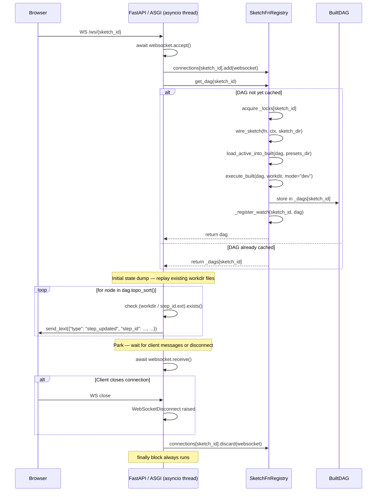

# WebSocket & File Watcher — End-to-End Sequence Diagrams

## Flow A: WebSocket connect → initial state dump → disconnect



---

## Flow B: File change → watcher callback → re-execute → broadcast

```mermaid
sequenceDiagram
    participant FS as Filesystem
    participant WD as watchdog Observer (OS thread)
    participant Handler as _SourceFileHandler (OS thread)
    participant on_change as on_change closure (OS thread)
    participant Executor as execute_partial_built (OS thread)
    participant DAG as BuiltDAG (shared mutable)
    participant Loop as asyncio event loop (main thread)
    participant Registry as SketchFnRegistry.broadcast_results (main thread)
    participant Browser

    FS->>WD: inotify / kqueue / FSEvents event
    WD->>Handler: on_modified / on_created / on_moved(event)
    Handler->>Handler: _matches(event.src_path)
    Handler->>on_change: callback()

    Note over on_change,DAG: Crosses thread boundary — no lock held
    on_change->>Executor: execute_partial_built(dag, [source_step_id], workdir)
    Executor->>DAG: read node.source_ids, node.param_values
    Executor->>Executor: call node.fn(**kwargs) for each node in subset
    Executor->>DAG: node.output = value  ⚠️ unsynchronised write
    Executor->>Executor: write workdir file (SketchValueProtocol or .txt)
    Executor-->>on_change: ExecutionResult

    Note over on_change,Loop: Thread boundary — schedule coroutine on asyncio loop
    on_change->>Loop: asyncio.run_coroutine_threadsafe(broadcast_results(...), loop)

    Note over Loop: Runs in asyncio event loop
    Loop->>Registry: await broadcast_results(sketch_id, dag, result)
    loop for node in dag.topo_sort()
        alt node.step_id in result.errors
            Registry->>Registry: await broadcast(sketch_id, {"type": "step_error", ...})
        else node.step_id in result.executed
            Registry->>Registry: await broadcast(sketch_id, {"type": "step_updated", ...})
        end
    end

    Registry->>Registry: broadcast() — iterate list(connections[sketch_id])
    loop for ws in snapshot of connections set
        Registry->>Browser: await ws.send_text(json.dumps(message))
        alt send fails
            Registry->>Registry: collect ws in dead set
        end
    end
    Registry->>Registry: connections[sketch_id] -= dead
```

---

## Responsibility Verdicts

| Class / Function | Verdict | Rationale |
|---|---|---|
| `sketch_ws_endpoint` | **overloaded** | Handles accept, initial-state dump, connection tracking, and park-until-disconnect in one flat function. The initial dump logic (topo sort, file existence check, message construction) belongs in a dedicated `dump_initial_state` helper. |
| `SketchFnRegistry` | **overloaded** | Owns five distinct concerns: DAG cache, lazy load, watcher lifecycle, WebSocket connection tracking, and param mutation. That is too much for one class. Watcher setup and broadcast should live in separate collaborators. |
| `SketchFnRegistry.get_dag` | **clean** | Double-checked locking pattern is correct; fast path avoids the lock entirely. |
| `SketchFnRegistry._load_dag_lazy` | **clean** | Single-responsibility: wire → load preset → execute → register watch. Correctly called only under the lock. |
| `SketchFnRegistry.start_watcher` | **clean** | Captures the running event loop, creates and starts the Watcher, seeds already-loaded DAGs. Straightforward lifecycle method. |
| `SketchFnRegistry._register_watch` | **overloaded** | Registers the watch and defines the re-execution + broadcast closure inline. The closure captures `execute_partial_built`, `run_coroutine_threadsafe`, and `self.broadcast_results` — it is a mini-coordinator that deserves its own named method or object. |
| `SketchFnRegistry.on_change` (closure inside `_register_watch`) | **unclear** | Anonymous closure with default-argument capture to avoid late-binding bugs — the pattern is correct but not obvious. The name `on_change` is never visible externally; a named inner function would make the watchdog call stack readable. |
| `SketchFnRegistry.broadcast` | **clean** | Snapshots the connection set before iteration, collects dead sockets, removes them after. Correct and minimal. |
| `SketchFnRegistry.broadcast_results` | **clean** | Iterates executed/error sets and delegates to `broadcast`. Single responsibility. |
| `SketchFnRegistry.set_param` | **clean** | Mutates param value, persists to disk, re-executes partial DAG. Linear and obvious. |
| `SketchFnRegistry.evict` | **clean** | Minimal cache invalidation; no side effects. |
| `Watcher` | **clean** | Thin wrapper around watchdog Observer; single-responsibility file observation. |
| `_SourceFileHandler` | **clean** | Handles all four watchdog event types (modify, create, delete, move-away / move-onto) with correct path resolution. |
| `execute_built` | **clean** | Delegates to `_execute_nodes` with `subset=None`. |
| `execute_partial_built` | **clean** | Computes the affected subset (start_ids + descendants) then delegates to `_execute_nodes`. |
| `_execute_nodes` | **clean** | Topological walk with upstream-failure propagation and workdir writes. Does exactly one thing. |
| `BuiltNode` | **clean** | Plain dataclass; no behaviour. `output` field is set by executor — the mutable shared state concern is in the caller, not here. |
| `BuiltDAG.topo_sort` | **clean** | Returns a list copy of node values; safe to iterate while the dict is mutated elsewhere (one-shot snapshot). |
| `BuiltDAG.descendants` | **unclear** | BFS using a list as a queue is O(n²) against the node count. Should use `collections.deque`. Not a correctness issue but worth flagging. |
| `wire_sketch` | **clean** | Resolves recording context to a BuiltDAG in one linear pass. Well-structured. |
| `create_app` (lifespan) | **clean** | Captures the running event loop and hands it to `start_watcher` at startup; stops the watcher on shutdown. Idiomatic FastAPI lifespan usage. |

---

## Follow-up Prompts

### FP-1: Unsynchronised `BuiltNode.output` mutations during concurrent execution

**Concern:** `execute_partial_built` is called on the watchdog OS thread (inside the `on_change` closure in `_register_watch`) and may also be called on the asyncio thread (via `set_param` from `update_param`, or `execute_built` from `new_preset` / `load_preset`). Both paths write to `BuiltNode.output` without any lock. If a param update arrives (asyncio thread) while a file-change re-execution is in progress (watchdog thread), the two executors race over `node.output` and `node.param_values`. The `_locks` dict in `SketchFnRegistry` guards only `_load_dag_lazy` — it offers no protection here.

**Prompt to paste:**

> In `framework/src/sketchbook/server/fn_registry.py`, `execute_partial_built` can be called concurrently from two different threads: the watchdog observer thread (via the `on_change` closure in `_register_watch`) and the asyncio event loop thread (via `set_param` → `execute_partial_built`, or `update_param` → `set_param`). Both paths mutate `BuiltNode.output` and read `node.param_values` without synchronisation. Audit this race: (1) identify all code paths that call any `execute_*` function, (2) determine whether they can overlap in time, (3) propose a fix — either a per-sketch execution lock, moving all execution onto the asyncio thread via `run_in_executor`, or making execution always happen on the watchdog thread and posting only the result to the loop.

---

### FP-2: Connection set mutation safety during broadcast

**Concern:** `broadcast` takes a snapshot of the connection set via `list(self.connections.get(sketch_id, []))` before iterating, which prevents `RuntimeError: Set changed size during iteration`. However, the set itself (`self.connections[sketch_id]`) is a plain `set` shared between the asyncio thread (which calls `broadcast` and `discard`) and the `sketch_ws_endpoint` coroutine (which calls `.add`). Because FastAPI / Starlette runs all request handlers on the same asyncio event loop thread and WebSocket coroutines are cooperative, there is no true concurrent mutation — `add` and `discard` never interleave with `broadcast` within a single event loop turn. But this correctness argument is implicit and fragile: if any caller ever schedules work on a thread pool that touches `connections`, the guarantee breaks silently. The snapshot in `broadcast` is good practice; the concern is that there is no documentation of the threading contract.

**Prompt to paste:**

> In `framework/src/sketchbook/server/fn_registry.py`, `SketchFnRegistry.connections` is a `dict[str, set[WebSocket]]` accessed from both the asyncio event loop (all `broadcast*` calls, `sketch_ws_endpoint`) and potentially from the watchdog thread via `run_coroutine_threadsafe(broadcast_results(...))`. Verify whether `run_coroutine_threadsafe` guarantees that `broadcast_results` and all its callees execute exclusively on the event loop thread (it should — that is the point of the API). If confirmed, document this invariant with a comment. If any path breaks it, propose a fix (e.g., `asyncio.Queue` or wrapping connection mutations in `loop.call_soon_threadsafe`).

---

### FP-3: `run_coroutine_threadsafe` correctness and missing error handling

**Concern:** The `on_change` closure calls `asyncio.run_coroutine_threadsafe(self.broadcast_results(...), self._loop)` and discards the returned `concurrent.futures.Future`. If `broadcast_results` raises (e.g., a dead socket that slips through the `dead` set cleanup), the exception is silently swallowed — no log, no crash, no retry. Additionally, `self._loop` is set in `start_watcher` and cleared in `stop_watcher`; between the two, a file event could fire after `stop_watcher` sets `self._loop = None`, causing an `AttributeError` or passing `None` to `run_coroutine_threadsafe`.

**Prompt to paste:**

> In `SketchFnRegistry._register_watch` (in `framework/src/sketchbook/server/fn_registry.py`), the `on_change` closure calls `asyncio.run_coroutine_threadsafe(self.broadcast_results(...), self._loop)` but never awaits or `.result()`-checks the returned `Future`. This means any exception in `broadcast_results` is silently dropped. Additionally, `self._loop` can become `None` after `stop_watcher()` while a file-system event is still in flight on the watchdog thread. Fix both issues: (1) add a `done_callback` on the Future that logs any exception, and (2) guard against `self._loop is None` in the closure before calling `run_coroutine_threadsafe`.

---

### FP-4: Late-binding closure bug — already fixed but worth a test

**Concern:** `_register_watch` iterates `dag.source_paths` and defines `on_change` inside the loop. The default-argument capture pattern (`sid: str = sketch_id`, `d: BuiltDAG = dag`, `nid: str = source_step_id`, `wd: Path = workdir`) correctly avoids the classic Python late-binding closure bug. This is good. However, there is no unit test that exercises multiple source paths in one DAG to verify each callback fires with the correct `nid`. If someone refactors the closure to a `lambda` or removes the defaults, the bug reappears silently.

**Prompt to paste:**

> Add a unit test in `framework/tests/` for `SketchFnRegistry._register_watch` (or the `on_change` closure it produces) that constructs a DAG with two source paths and verifies that file-change callbacks fire with the correct `source_step_id` for each path independently. This guards against re-introducing the classic Python loop-closure late-binding bug. Use `unittest.mock.patch` on `execute_partial_built` to avoid actual filesystem I/O.

---

### FP-5: `BuiltDAG.descendants` BFS uses a list as a queue (O(n²))

**Concern:** `descendants` in `built_dag.py` uses `queue.pop(0)` which is O(n) on a list, making the BFS O(n²) overall. For large pipelines this degrades noticeably.

**Prompt to paste:**

> `BuiltDAG.descendants` in `framework/src/sketchbook/core/built_dag.py` uses `list.pop(0)` for BFS, which is O(n) per dequeue and makes the whole traversal O(n²). Replace the list-based queue with `collections.deque` and `.popleft()`. Add or update a unit test that asserts the correct descendant set for a known DAG topology.
