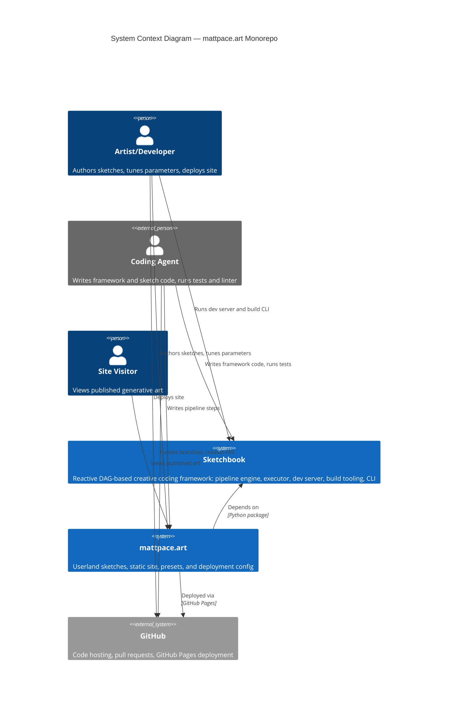
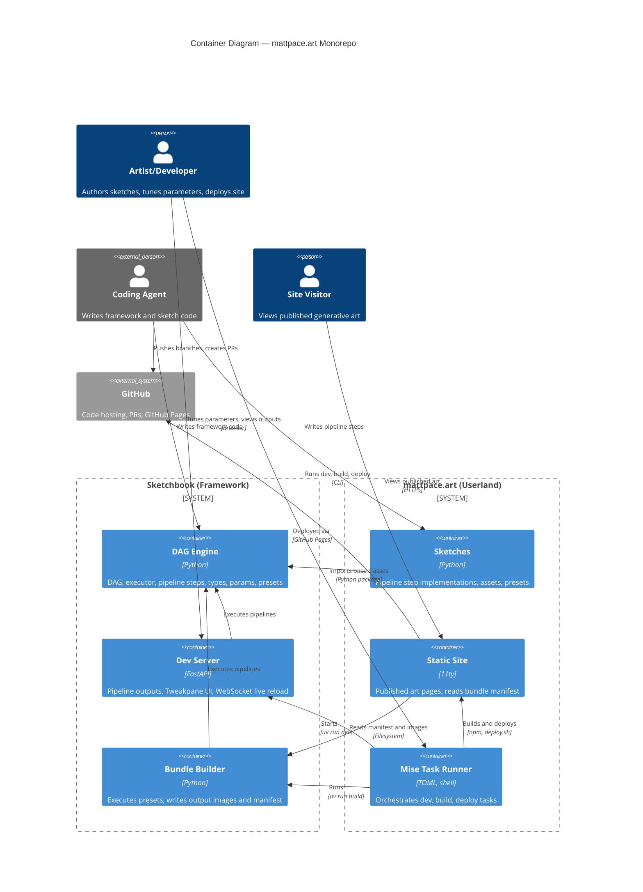

# C4 System Context Diagram

```mermaid
C4Context
    title System Context Diagram — mattpace.art Monorepo

    Person(artist, "Artist/Developer", "Authors sketches, tunes parameters, deploys site")
    Person_Ext(agent, "Coding Agent", "Writes framework and sketch code, runs tests and linter")
    Person(visitor, "Site Visitor", "Views published generative art")

    System(sketchbook, "Sketchbook", "Reactive DAG-based creative coding framework: pipeline engine, executor, dev server, build tooling, CLI")
    System(userland, "mattpace.art", "Userland sketches, static site, presets, and deployment config")

    System_Ext(github, "GitHub", "Code hosting, pull requests, GitHub Pages deployment")

    Rel_D(artist, sketchbook, "Runs dev server and build CLI")
    Rel_D(artist, userland, "Authors sketches, tunes parameters")
    Rel_R(artist, github, "Deploys site")

    Rel_D(agent, sketchbook, "Writes framework code, runs tests")
    Rel_D(agent, userland, "Writes pipeline steps")
    Rel_R(agent, github, "Pushes branches, creates PRs")

    Rel_D(visitor, userland, "Views published art")

    Rel_R(userland, sketchbook, "Depends on", "Python package")
    Rel_D(userland, github, "Deployed via", "GitHub Pages")

    UpdateLayoutConfig($c4ShapeInRow="3", $c4BoundaryInRow="2")
```

# C4 Container Diagram

```mermaid
C4Container
    title Container Diagram — mattpace.art Monorepo

    Person(artist, "Artist/Developer", "Authors sketches, tunes parameters, deploys site")
    Person_Ext(agent, "Coding Agent", "Writes framework and sketch code")
    Person(visitor, "Site Visitor", "Views published generative art")

    System_Ext(github, "GitHub", "Code hosting, PRs, GitHub Pages")

    System_Boundary(sketchbook, "Sketchbook (Framework)") {
        Container(dag_engine, "DAG Engine", "Python", "DAG, executor, pipeline steps, types, params, presets")
        Container(dev_server, "Dev Server", "FastAPI", "Pipeline outputs, Tweakpane UI, WebSocket live reload")
        Container(bundle_builder, "Bundle Builder", "Python", "Executes presets, writes output images and manifest")
    }

    System_Boundary(userland, "mattpace.art (Userland)") {
        Container(sketches, "Sketches", "Python", "Pipeline step implementations, assets, presets")
        Container(static_site, "Static Site", "11ty", "Published art pages, reads bundle manifest")
        Container(mise, "Mise Task Runner", "TOML, shell", "Orchestrates dev, build, deploy tasks")
    }

    Rel_D(artist, dev_server, "Tunes parameters, views outputs", "Browser")
    Rel_D(artist, mise, "Runs dev, build, deploy", "CLI")

    Rel_D(agent, sketches, "Writes pipeline steps")
    Rel_D(agent, dag_engine, "Writes framework code")
    Rel_L(agent, github, "Pushes branches, creates PRs")

    Rel_D(visitor, static_site, "Views published art", "HTTPS")

    Rel_R(dev_server, dag_engine, "Executes pipelines")
    Rel_R(bundle_builder, dag_engine, "Executes pipelines")

    Rel_R(sketches, dag_engine, "Imports base classes", "Python package")
    Rel_L(static_site, bundle_builder, "Reads manifest and images", "Filesystem")

    Rel_D(mise, dev_server, "Starts", "uv run dev")
    Rel_D(mise, bundle_builder, "Runs", "uv run build")
    Rel_D(mise, static_site, "Builds and deploys", "npm, deploy.sh")

    Rel_D(static_site, github, "Deployed via", "GitHub Pages")

    UpdateLayoutConfig($c4ShapeInRow="3", $c4BoundaryInRow="2")
```
