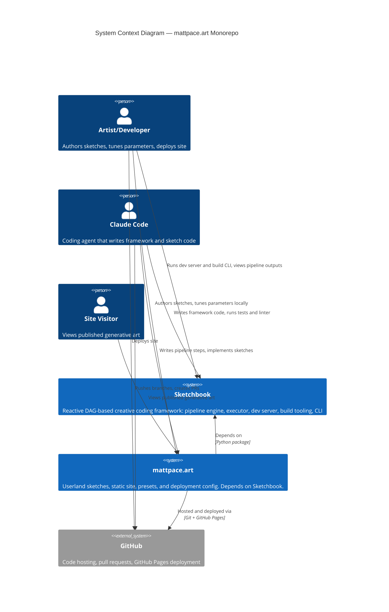

# C4 System Context Diagram

```mermaid
C4Context
    title System Context Diagram — mattpace.art Monorepo

    Person(artist, "Artist/Developer", "Authors sketches, tunes parameters, deploys site")
    Person(agent, "Claude Code", "Coding agent that writes framework and sketch code")
    Person(visitor, "Site Visitor", "Views published generative art")

    System(sketchbook, "Sketchbook", "Reactive DAG-based creative coding framework: pipeline engine, executor, dev server, build tooling, CLI")
    System(userland, "mattpace.art", "Userland sketches, static site, presets, and deployment config. Depends on Sketchbook.")

    System_Ext(github, "GitHub", "Code hosting, pull requests, GitHub Pages deployment")

    Rel(artist, sketchbook, "Runs dev server and build CLI, views pipeline outputs")
    Rel(artist, userland, "Authors sketches, tunes parameters locally")
    Rel(artist, github, "Deploys site")

    Rel(agent, sketchbook, "Writes framework code, runs tests and linter")
    Rel(agent, userland, "Writes pipeline steps, implements sketches")
    Rel(agent, github, "Pushes branches, creates PRs")

    Rel(visitor, userland, "Views published generative art")

    Rel(userland, sketchbook, "Depends on", "Python package")
    Rel(userland, github, "Hosted and deployed via", "Git + GitHub Pages")
```
